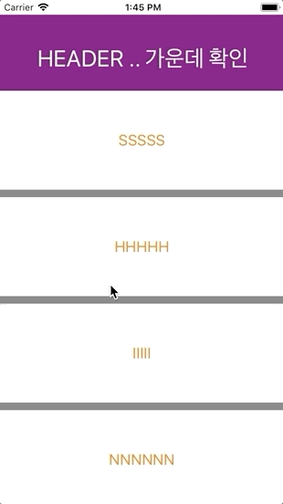
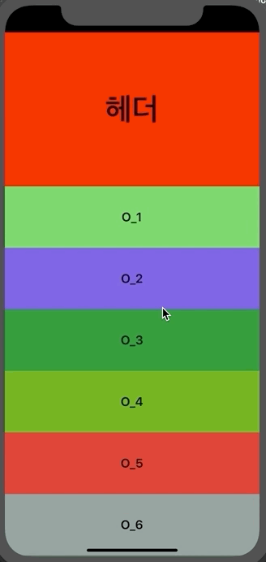

# CollectionViewHeaderTest1

## sticky header

아래로 스크롤할땐 헤더고정 + 위로 스크롤할땐 헤더가 함께 스크롤 되는 대신에, 위에서부터 사라지는것이 아닌 중간에 찌그러지는 형태


- custom flowlayout 생성
  * sectionHeadersPinToVisibleBounds =  true 설정
  * layoutAttributesForSupplementaryView 메소드에서 스크롤에 따라 header frame 이 변경될 정보를 지정해줌
  * layoutAttributesForElements 가 없으면 크래시

- 위로 스크롤할때 cell 이 header를 가리므로 willDisplay:forItemAt 이나 willDisplaySupplementaryView 로 layer.zPosition 를 맞춰줌
(낮은수가 더 순위가 낮음)

# CollectionViewHeaderTest2

## cell animation

CollectionViewHeaderTest1 + cell horizontal 제스처 애니메이션


- collectionview 2개를 이용함
   * main collectionview 의 cell에 sub collectionview 를 가지는 viewcontroller.view 를 hosting 시키는 방범
   * 스크롤이 따로 놀게되므로 subViewController 의 collectionViewContentSize 를 mainViewController 로 알려주어 cell 사이즈를 지정해주고, sub의 스크롤은 `isScrollEnabled = false` 처리
- animation
```swift
UIView.animate(withDuration: 0.5, delay: 2, usingSpringWithDamping: 1, initialSpringVelocity: 0.5, options: gestureDirection == .right ? .transitionFlipFromLeft : .transitionFlipFromRight, animations: {
            
            if self.gestureDirection == .right {
                //FromLefttoRight
                var transition: CATransition? = nil
                transition = CATransition.init()
                transition?.duration = 0.4
                transition?.timingFunction = CAMediaTimingFunction(name: CAMediaTimingFunctionName.easeInEaseOut)
                transition?.type = CATransitionType.push
                transition?.subtype = CATransitionSubtype.fromLeft
                cell.layer.add(transition!, forKey: nil)
            } else {
                //FromRighttoLeft
                var transition: CATransition? = nil
                transition = CATransition.init()
                transition?.duration = 0.4
                transition?.timingFunction = CAMediaTimingFunction(name: CAMediaTimingFunctionName.easeInEaseOut)
                transition?.type = CATransitionType.push
                transition?.subtype = CATransitionSubtype.fromRight
                cell.layer.add(transition!, forKey: nil)
            }
            
        }, completion: { (done) in
            
        })
```
   
   
   
   
   
   
